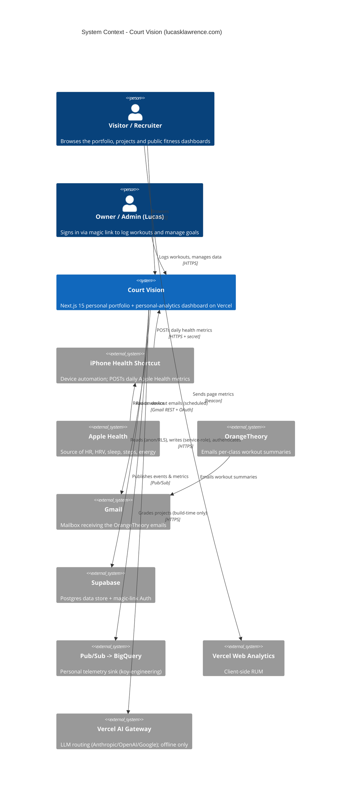
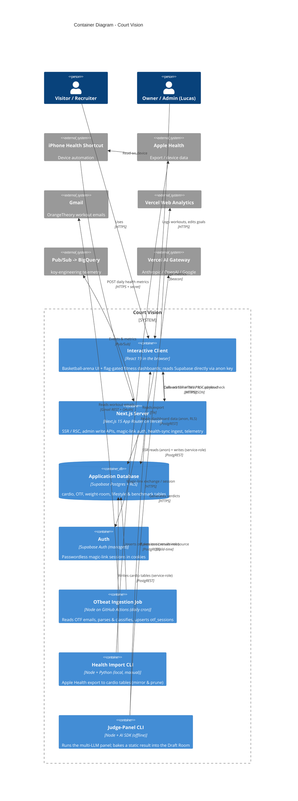
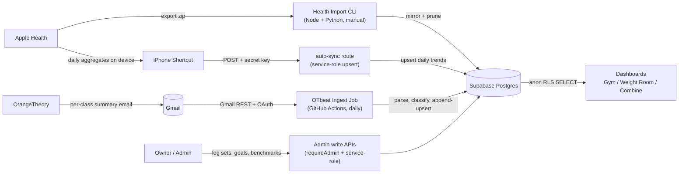
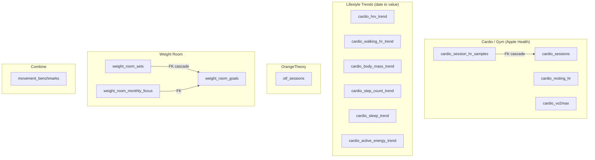

# Court Vision — Architecture (C4 Model)

A [C4](https://c4model.com/) view of **Court Vision** (`lucasklawrence.com`) — a basketball‑themed personal
portfolio that doubles as a private personal‑analytics dashboard for fitness data.

**Stack:** Next.js 15 (App Router, RSC) · React 19 · TypeScript · Tailwind 4 · Supabase (Postgres + Auth) ·
framer‑motion · roughjs + d3‑scale · Zod · Vercel (hosting + Web Analytics). Ingestion/tooling in Node + Python;
CI and scheduled jobs on GitHub Actions.

**Snapshot:** `main` @ `b37fde1` (#279), July 2026.

> **How to read this.** C4 describes software as four nested levels of zoom — **Context** (the system among its
> users and neighbours), **Containers** (separately deployable/runnable things + data stores), **Components**
> (the major building blocks inside a container), and Code. This doc covers L1–L3 plus two supplementary views
> (data ingestion and the data model). All diagrams are Mermaid and render on GitHub.

---

## 1. System Context (L1)

Who and what Court Vision talks to.

**Actors**

- **Visitor / Recruiter** — the primary audience. Sees the public "arena" (court, locker room, project binder,
  banners, contact) and any flag‑enabled dashboards. No account.
- **Owner / Admin (Lucas)** — authenticates via Supabase magic link; unlocks workout logging, goal/benchmark
  editing, and the `/api/admin/*` write endpoints. Authorization is an email allowlist (`ADMIN_EMAILS`).
- **iPhone Health Shortcut** — a *non‑human* actor. A device automation that reads Apple Health and POSTs daily
  aggregates to the ingest endpoint with a shared secret.

**External systems**

- **Supabase** — the single source of truth (Postgres) and the identity provider (passwordless magic‑link Auth).
- **Gmail + OrangeTheory** — OTF has no public API; it emails per‑class summaries, which the app reads from Gmail.
- **Pub/Sub → BigQuery** — a personal telemetry sink (`koy-engineering`) fed best‑effort from server routes.
- **Vercel Web Analytics** — client‑side RUM beacon.
- **Vercel AI Gateway** — used **only offline** (build/authoring time) to generate the Draft Room's judge‑panel
  result; the deployed app makes **no** LLM calls at request time.

---

## 2. Containers (L2)

The separately runnable pieces and where data lives. Note the deliberate split: the **browser client reads
Supabase directly** (anon key under RLS) — there is no read API — while **all writes** funnel through the server
behind an auth gate using the service‑role key.

| Container | Tech | Responsibility |
|---|---|---|
| **Interactive Client** | React 19 (browser) | The SVG "arena" UI and the fitness dashboards. Reads dashboard data straight from Supabase via the anon key (RLS‑limited); calls the server only for admin writes and the admin‑status probe. |
| **Next.js Server** | Next.js 15 App Router on Vercel | SSR/RSC rendering, the `/api/admin/*` write endpoints, magic‑link auth (`/auth/*`), the token‑authed `/api/health/auto-sync` ingest, and the telemetry wrapper. |
| **Application Database** | Supabase Postgres (RLS) | All persistent data. RLS grants `SELECT` to anon/authenticated; every mutation requires the service‑role key. |
| **Auth** | Supabase Auth (managed) | Passwordless magic‑link (PKCE); session stored in cookies via `@supabase/ssr`. |
| **OTbeat Ingestion Job** | Node on GitHub Actions | Daily cron: reads OrangeTheory emails from Gmail, parses HTML, classifies anomaly + class‑type, append‑upserts `otf_sessions`. |
| **Health Import CLI** | Node + Python (local) | Manual full‑archive import of an Apple Health export → cardio tables (mirror‑and‑prune). |
| **Judge‑Panel CLI** | Node + AI SDK (offline) | Runs a multi‑LLM "draft panel" and bakes a static result into the Draft Room. Not part of the request path. |

---

## 3. Components — the Web App (L3)

Zooming into the Next.js container (client + server components share a module tree in App Router).

```mermaid
C4Component
  title Component Diagram - Next.js Web App (client + server)

  Person(visitor, "Visitor", "")
  Person(owner, "Owner / Admin", "")
  System_Ext(shortcut, "iPhone Health Shortcut", "")

  Container_Boundary(web, "Next.js Web App") {
    Component(publicui, "Public Arena UI", "React client components", "Court, Locker Room, Project Binder, Banners, Contact, Draft Room (static replay)")
    Component(fitui, "Training Facility UI", "React (flag-gated)", "Gym / Weight Room / Combine dashboards")
    Component(charts, "Chart Library", "roughjs + d3-scale", "Hand-drawn SVG line/bar/sparkline/zone charts + regression overlay")
    Component(motion, "Motion System", "framer-motion (LazyMotion + m)", "Code-split entrance & layout animations")
    Component(svg, "SVG Composition", "React SVG + foreignObject", "SvgUse / SafeSvgHtml; Safari variants")
    Component(flags, "Feature Flags", "NEXT_PUBLIC_ENABLE_*", "Gate Training Facility + Draft Room")

    Component(dataserver, "Data Access (server)", "lib/data/*-server.ts", "RSC reads via server Supabase client")
    Component(databrowser, "Data Access (browser)", "lib/data/*.ts", "Client reads via browser Supabase client")
    Component(datashared, "Assemblers + Schemas", "lib/data/*-shared.ts + Zod", "Pure row-to-view shaping shared by both read paths")

    Component(api, "Route Handlers", "app/api/**", "Admin writes, admin-check, health auto-sync")
    Component(authz, "Auth & Authorization", "lib/auth + app/auth", "Magic-link login, callback, requireAdmin, ADMIN_EMAILS allowlist")
    Component(supaclients, "Supabase Clients", "lib/supabase", "anon (RLS) / anon+cookie / service-role")
    Component(telemetry, "Telemetry", "withTelemetry + lib/telemetry", "Per-request events + domain metrics")
  }

  ContainerDb(postgres, "Supabase Postgres", "", "")
  Container(authsvc, "Supabase Auth", "", "")
  System_Ext(pubsub, "Pub/Sub -> BigQuery", "")

  Rel(visitor, publicui, "Uses", "HTTPS")
  Rel(owner, fitui, "Logs sets / edits goals", "HTTPS")
  Rel(shortcut, api, "POST /api/health/auto-sync", "HTTPS + key")

  Rel(publicui, motion, "Animates with")
  Rel(publicui, svg, "Renders")
  Rel(fitui, charts, "Renders")
  Rel(fitui, databrowser, "Reads via")
  Rel(flags, fitui, "Gates")

  Rel(dataserver, datashared, "Shapes rows with")
  Rel(databrowser, datashared, "Shapes rows with")
  Rel(dataserver, supaclients, "Server client")
  Rel(databrowser, supaclients, "Browser client")
  Rel(api, authz, "Guards with requireAdmin")
  Rel(api, supaclients, "Writes via service-role")
  Rel(api, telemetry, "Wrapped by")
  Rel(authz, authsvc, "Magic-link / session", "HTTPS")
  Rel(supaclients, postgres, "Reads / writes", "PostgREST")
  Rel(telemetry, pubsub, "Publishes", "Pub/Sub")
```

**UI**

- **Public Arena UI** — the interactive SVG court homepage and the themed rooms (Locker Room, Project Binder,
  Banners/The Rafters, Contact, and the Draft Room, which replays a pre‑baked panel result).
- **Training Facility UI** — the flag‑gated fitness dashboards: Gym (cardio + OTF + HR‑zone reconciliation),
  Weight Room (strength logging + trends), and Combine (movement benchmarks).

**Cross‑cutting client systems**

- **Chart Library** (`components/training-facility/shared/charts`) — a custom, hand‑drawn SVG chart kit built on
  **roughjs** + **d3‑scale** (no Recharts/Chart.js): `RoughLine` (with a dashed regression/rolling‑average
  overlay), `RoughSparkline`, `RoughBar`, `RoughScatter`, hand‑drawn axes, shared palette; all `role="img"`.
- **Motion System** — framer‑motion via the **LazyMotion + `m`** pattern (`domMax` features are code‑split out of
  the initial bundle; `strict` mode forbids the heavier `motion.*`). Honors `prefers-reduced-motion`.
- **SVG Composition** — `SvgUse`, `SafeSvgHtml` (renders HTML in `<foreignObject>` for Safari), responsive
  layout containers; content zones ship base/`Modern`/`Safari` render variants.

**Server‑side**

- **Data Access** — split by execution context into `*-server.ts` (server‑only), `*.ts` (browser), and a shared
  `*-shared.ts` pure assembler that imports **neither** Supabase client, so the two read paths can't drift.
  Rows are Zod‑validated against `lib/schemas`. A pager works around PostgREST's 1000‑row cap.
- **Supabase Clients** — three tiers = three trust levels: **browser** (anon), **server** (anon + session
  cookie), **admin** (service‑role, RLS‑bypass, `server-only`).
- **Auth & Authorization** — magic‑link login (`sendMagicLink` server action) → `/auth/callback`
  (`exchangeCodeForSession`) → cookie session. `requireAdmin()` guards API routes (401/403);
  `requireAdminPage()` guards Server‑Component pages (→ `notFound()`); both check the `ADMIN_EMAILS` allowlist.
  **There is no `middleware.ts`** — protection is per‑route in application code.
- **Telemetry** — a `withTelemetry` wrapper emits one health event per request (plus domain metrics like
  `weight_room_set_logged`) to Pub/Sub; best‑effort and PII‑guarded, `TELEMETRY_DISABLED=1` no‑ops it.

---

## 4. Data ingestion & flow

Four independent write paths land in Supabase; everything is read back out under RLS. Reads are anon
(browser **and** server); writes always use the service‑role key behind a gate (an auth check or a shared secret).

| Path | Trigger | Source → destination | Idempotency |
|---|---|---|---|
| **Apple Health full import** | Manual CLI (`npm run import-health`) | Health export zip → Python preprocess → cardio session/HR/trend tables | Mirror‑and‑prune (deletes rows older than the batch; empty‑payload guard) |
| **Apple Health auto‑sync** | iPhone Shortcut → `POST /api/health/auto-sync` (`X-Health-Sync-Key`) | Daily aggregates → 5 lifestyle trend tables (HRV, walking‑HR, steps, sleep, active‑energy) | Upsert one row per `date` |
| **OTbeat ingest** | GitHub Actions cron `0 7 * * *` | Gmail (OTF emails) → parse/classify → `otf_sessions` | Append‑upsert, ~8‑day lookback so missed runs self‑heal |
| **Admin writes** | Owner in the UI → `/api/admin/*` | Form input → `requireAdmin` → `weight_room_*`, `movement_benchmarks` | Insert / upsert / delete |

*(Bodyweight trend is populated separately via the bodyweight‑logging flow, not the auto‑sync batch.)*

---

## 5. Data model (Supabase schema)

Every table follows the same RLS pattern — public `SELECT`, service‑role‑only writes.

| Domain | Tables | Notes |
|---|---|---|
| **Cardio / Gym** | `cardio_sessions` (PK `started_at`), `cardio_session_hr_samples` (FK→sessions, cascade; ~2k samples/session), `cardio_resting_hr`, `cardio_vo2max` | Derived from Apple Health / Apple Watch. |
| **Lifestyle trends** | `cardio_{hrv,walking_hr,body_mass,step_count,sleep,active_energy}_trend` | Six identical `(date PK, value)` tables. |
| **OrangeTheory** | `otf_sessions` (PK `started_at`) | Per‑class metrics + `treadmill`/`rower` JSONB, `excluded` anomaly flag, inferred `class_type` (+ manual override). Append‑only. |
| **Weight Room** | `weight_room_goals` (PK `exercise`), `weight_room_sets` (FK→goals), `weight_room_monthly_focus` | "Grease the groove" strength logging + rotating monthly focus. |
| **Combine** | `movement_benchmarks` (PK `date`) | Athletic benchmarks. Migration applied directly to Supabase (not in `supabase/migrations/`). |

---

## 6. Key architectural decisions

| Decision | What & why |
|---|---|
| **Anon reads, gated writes** | Public dashboards read Supabase directly (anon key, RLS `SELECT`) — no bespoke read API to maintain. Writes are impossible with the anon key; they must pass through a server route holding the service‑role key. Security lives in RLS + one app‑layer gate. |
| **Three Supabase clients** | browser (anon) · server (anon + cookie) · admin (service‑role, `server-only`). The service‑role key never reaches the browser and is only reachable behind `requireAdmin` or the auto‑sync secret. |
| **`server / shared / browser` data split** | `*-shared.ts` holds the pure row→view logic and imports no client, guaranteeing the server and browser read paths produce identical shapes and neither bundle leaks into the other. |
| **Feature flags for dark launch** | `NEXT_PUBLIC_ENABLE_TRAINING_FACILITY` and `NEXT_PUBLIC_ENABLE_DRAFT_ROOM` (both default **off**) gate whole areas to 404, so in‑progress features ship to `main` without being publicly reachable. |
| **No middleware** | Route protection is per‑route (`requireAdmin` / `requireAdminPage`), keeping auth logic beside the code it protects and off the edge. |
| **Hand‑drawn chart kit** | A custom roughjs + d3‑scale SVG library instead of a charting framework — matches the sketchy "scouting report" brand and keeps the bundle lean. |
| **LazyMotion perf** | framer's `domMax` feature set is dynamically imported so animation code is code‑split out of the initial JS. |
| **Offline judge panel** | The multi‑LLM "draft panel" runs at authoring time via a CLI; the Draft Room ships a **baked** result. Zero runtime AI cost, latency, or key exposure. |
| **GitHub Actions for cron** | Scheduled ingestion runs as a GitHub Action, not a Vercel cron — no `vercel.json`. Keeps secrets and the Node+Gmail toolchain in CI. |
| **Idempotent ingestion** | Cardio import mirrors‑and‑prunes (full archive is source of truth); OTbeat append‑upserts with a wide lookback so a missed cron run self‑heals. |
| **Personal telemetry** | Server routes emit best‑effort events to a personal Pub/Sub → BigQuery pipeline for an external app‑health dashboard; disabled by an env flag. |

---

## 7. Where things live

| Concern | Path |
|---|---|
| Routes (pages, API, auth) | `app/**` |
| UI families | `components/**` (`court/`, `locker-room/`, `project-binder/`, `draft-room/`, `banners/`, `training-facility/`, `motion/`, `common/`) |
| Chart library | `components/training-facility/shared/charts/` |
| Data access | `lib/data/**` (`*-server.ts` / `*.ts` / `*-shared.ts`) |
| Supabase clients | `lib/supabase/{browser,server,admin,env}.ts` |
| Auth & allowlist | `lib/auth/**`, `app/auth/**`, `app/admin/login/` |
| Zod schemas | `lib/schemas/**` |
| Feature flags | `lib/feature-flags.ts` |
| Telemetry | `lib/telemetry/**`, `instrumentation.ts` |
| Offline judge panel | `lib/panel/**`, `scripts/panel.ts`, `app/draft-room/panelResult.ts` |
| Ingestion scripts | `scripts/*.mjs`, `scripts/lib/**` |
| DB schema | `supabase/migrations/*.sql` |
| CI + scheduled cron | `.github/workflows/**` (`otbeat-ingest.yml` is the daily cron) |

---

*Generated as a C4 architecture snapshot. Diagrams validated with the Mermaid renderer; update alongside
structural changes. See also [`design-system.md`](./design-system.md) for brand tokens.*
